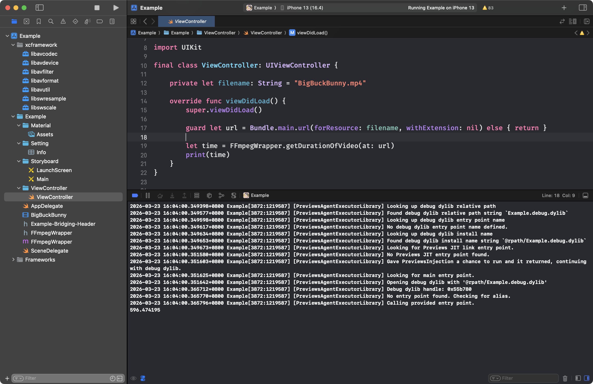

# [FFMpeg_XCFramework](https://william-weng.github.io/2026/03/ffmpeg跟ios終於在一起了/)

編譯FFMpeg原始碼，打包成XCFramework給iOS使用…



- 安裝yasm
```bash
brew install yasm
mkdir FFMpeg_XCFramework
cd FFMpeg_XCFramework
```

- 下載原始檔
```bash
export Source_Dir="src"
git clone --branch n7.1 https://git.ffmpeg.org/ffmpeg.git ${Source_Dir}
```

- 設定環境變數 (實機)
```bash
export Source_Dir="src"
export Arch="arm64"
export Target="arm64-apple-ios"
export SDK="iphoneos"
export Type="iphoneos"
export SupportedPlatform="iPhoneOS"
export MinVersion="16.0"
export Framework_Path=${Arch}-${SDK}
export SYSROOT=$(xcrun --sdk ${SDK} --show-sdk-path)
export CC="xcrun -sdk ${SDK} clang -target ${Target}"
export CXX="xcrun -sdk ${SDK} clang++ -target ${Target}" 
export CFLAGS="-arch ${Arch} -isysroot ${SYSROOT} -m${Type}-version-min=${MinVersion}"
export LDFLAGS="-arch ${Arch} -isysroot ${SYSROOT} -m${Type}-version-min=${MinVersion} -headerpad_max_install_names"
```

- 設定環境變數 (模擬器)
```bash
export Source_Dir="src"
export Arch="arm64"
export Target="arm64-apple-ios-simulator"
export SDK="iphonesimulator"
export Type="ios-simulator"
export MinVersion="16.0"
export SupportedPlatform="iPhoneSimulator"
export Framework_Path=${Arch}-${SDK}
export SYSROOT=$(xcrun --sdk ${SDK} --show-sdk-path)
export CC="xcrun -sdk ${SDK} clang -target ${Target}"
export CXX="xcrun -sdk ${SDK} clang++ -target ${Target}" 
export CFLAGS="-arch ${Arch} -isysroot ${SYSROOT} -m${Type}-version-min=${MinVersion}"
export LDFLAGS="-arch ${Arch} -isysroot ${SYSROOT} -m${Type}-version-min=${MinVersion} -headerpad_max_install_names"
```

- 建立安裝資料夾
```bash
mkdir installed
mkdir build
mkdir build/${Framework_Path}
cd build/${Framework_Path}
```

- 產生設定檔
```bash
../../${Source_Dir}/configure \
--prefix=../../installed/${Framework_Path} \
--disable-static \
--enable-shared \
--enable-cross-compile \
--target-os=darwin \
--arch=${Arch} \
--sysroot=${SYSROOT} \
--extra-cflags="-arch ${Arch} -m${Type}-version-min=${MinVersion} -fembed-bitcode" \
--extra-ldflags="-arch ${Arch} -m${Type}-version-min=${MinVersion}" \
--cc=${CC} \
--cxx=${CXX} \
--install-name-dir=@rpath \
--disable-audiotoolbox \
--disable-doc \
--disable-programs \
--disable-videotoolbox \
--enable-network
```

- 編譯原始碼
```bash
make -j$(sysctl -n hw.ncpu) 
make install
cd ../..
```

- 建立framework
```bash
chmod +x create.sh
./create.sh
```

- 合併framework
```bash
cd installed
chmod +x combine.sh
./combine.sh
```
